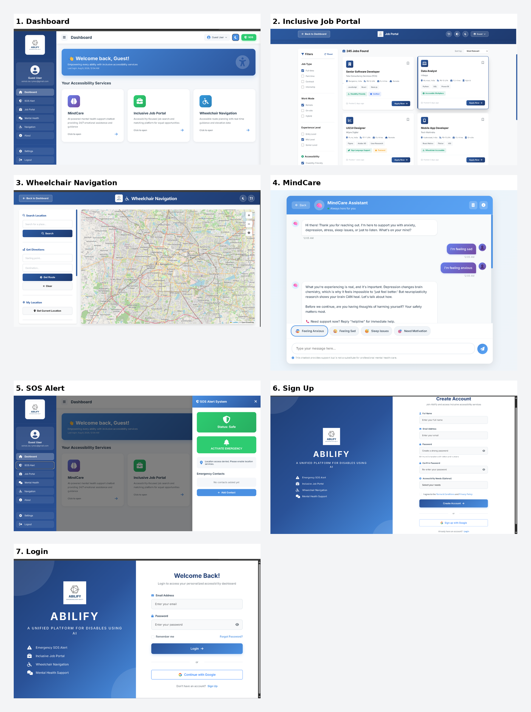

# ♿ ABILIFY – Inclusive Accessibility Platform

> An integrated accessibility platform designed to improve independence, communication, mobility, safety, and employment opportunities for people with disabilities.

---

## 🔗 Live Demo

👉 [View ABILIFY Live Demo]( https://sohebakthar.github.io/ablify/)

---

## 📌 About the Project

**ABILIFY** is an inclusive web-based accessibility platform that brings multiple assistive features together in one system.

The project focuses on making digital services more accessible by providing solutions for communication, navigation, emergency assistance, mental well-being, and employment.

---

## 🎯 Problem Statement

People with disabilities often need to use multiple applications and services for different accessibility requirements.

ABILIFY aims to provide a centralized platform where users can access multiple accessibility-oriented features through a simple and user-friendly interface.

---

## 💡 Proposed Solution

ABILIFY integrates multiple accessibility modules into a single web application.

The platform provides:

- 🗣️ Voice Assistant
- 🤟 Sign Language Recognition
- ♿ Wheelchair Navigation
- 🚨 SOS Emergency Alert
- 💼 Inclusive Job Portal
- 🧠 Mental Health Support
- 🤖 AI Chatbot Support

---

## 🚀 Key Features

### 🗣️ Voice Assistant
Provides voice-based interaction to improve accessibility and hands-free navigation.

### 🤟 Sign Language Recognition
Designed to assist communication through sign-language recognition technology.

### ♿ Wheelchair Navigation
Provides accessibility-focused navigation information to help users identify suitable routes and locations.

### 🚨 SOS Emergency Alert
Provides an emergency assistance interface for situations where the user requires immediate help.

### 💼 Inclusive Job Portal
Allows users to search for employment opportunities with accessibility-oriented job information and filtering options.

### 🧠 Mental Health Support
Provides a dedicated mental-health support section with an accessible interface.

### 🤖 AI Chatbot
Provides conversational assistance to help users interact with the platform.

---

## 📸 Project Screenshots



---

## 🛠️ Technologies Used

### Frontend
- HTML5
- CSS3
- JavaScript

### APIs & Services
- Adzuna Jobs API
- Google Fonts
- Browser Web APIs

### Development Tools
- Visual Studio Code
- Git
- GitHub
- Live Server

---

## 📂 Project Structure

```text
ABILIFY/
│
├── assets/
│   ├── abilify-logo.png
│   ├── chatbot-icon.png
│   ├── job-portal-icon.png
│   ├── sign-language-icon.png
│   ├── sos-icon.png
│   └── wheelchair-icon.png
│
├── css/
│   ├── auth.css
│   ├── chatbot.css
│   ├── dashboard.css
│   ├── job-portal.css
│   ├── modules.css
│   ├── navigation.css
│   └── splash.css
│
├── js/
│   ├── auth.js
│   ├── chatbot.js
│   ├── dashboard.js
│   ├── job-portal.js
│   ├── navigation.js
│   └── splash.js
│
├── pages/
│   ├── dashboard.html
│   ├── job-portal.html
│   ├── login.html
│   ├── mental-health.html
│   ├── navigation.html
│   └── signup.html
│
├── .gitignore
├── index.html
└── README.md
